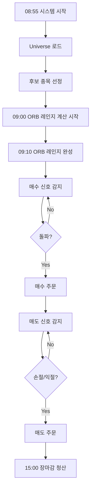

# ORB 전략 사용 가이드

## 개요

ORB (Opening Range Breakout) 전략은 장 초반 10분간의 가격 범위(Opening Range)를 기준으로 돌파 시점에 매수하는 전략입니다.

---

## 전략 개요

### 핵심 개념
- **Opening Range**: 09:00~09:10 (10분간) 형성된 고가/저가 범위
- **Breakout**: ORB 고가를 돌파하는 순간
- **갭 상승**: 전일 종가 대비 0.3~3% 상승 종목만 대상
- **거래량 확인**: ORB 구간 평균 거래량 대비 1.5배 이상

### 시간 흐름

```
08:55~08:59  | 후보 종목 선정 (Universe 300개 중 갭상승 종목 필터링)
             | - 갭 확인 (0.3~3%)
             | - 거래대금 확인 (100억+)
             | - ATR 계산
             |
09:00~09:10  | ORB 레인지 계산 (1분봉)
             | - 고가/저가 수집
             | - 레인지 유효성 검증 (0.3~2%)
             | - 평균 거래량 계산
             |
09:10~14:50  | 매수 신호 감지 (3분봉)
             | - ORB 고가 돌파
             | - 거래량 1.5배 이상
             |
09:10~15:00  | 매도 신호 감지
             | - 손절: ORB 저가
             | - 익절: ORB 고가 + (range × 2)
             |
15:00        | 장마감 일괄 청산
```

---

## 설정 방법

### 1. Universe 업데이트 (주간 1회)

매주 금요일 장마감 후 또는 주말에 실행:

```bash
python scripts/update_weekly_universe.py
```

결과 파일:
- `data/universe_YYYYMMDD.json` (300개 종목)
- KOSPI 200개 + KOSDAQ 100개

### 2. 전략 설정

[`config/orb_strategy_config.py`](../config/orb_strategy_config.py) 파일에서 파라미터 조정:

```python
@dataclass
class ORBStrategyConfig:
    # 갭 기준
    min_gap_ratio: float = 0.003  # 최소 갭 0.3%
    max_gap_ratio: float = 0.03   # 최대 갭 3%
    gap_direction: str = "up"     # "up" / "down" / "both"

    # ORB 시간
    orb_start_time: str = "09:00"
    orb_end_time: str = "09:10"   # 10분

    # 레인지 검증
    min_range_ratio: float = 0.003  # 최소 레인지 0.3%
    max_range_ratio: float = 0.020  # 최대 레인지 2%

    # 거래량 조건
    volume_surge_ratio: float = 1.5  # 1.5배

    # 익절/손절
    stop_loss_type: str = "orb_low"  # ORB 저가
    take_profit_multiplier: float = 2.0  # range × 2

    # 거래대금
    min_trading_amount: int = 10_000_000_000  # 100억
```

### 3. 메인 설정 파일

[`config/trading_config.json`](../config/trading_config.json)에 전략 지정:

```json
{
  "strategy": {
    "name": "orb",
    "type": "integrated"
  }
}
```

---

## 코드 구조

### 핵심 파일

| 파일 | 역할 |
|------|------|
| [`strategies/trading_strategy.py`](../strategies/trading_strategy.py) | 통합 전략 인터페이스 (후보 선정 + 매매 판단) |
| [`strategies/orb_strategy.py`](../strategies/orb_strategy.py) | ORB 전략 구현 |
| [`config/orb_strategy_config.py`](../config/orb_strategy_config.py) | ORB 전략 설정 |
| [`scripts/update_weekly_universe.py`](../scripts/update_weekly_universe.py) | Universe 업데이트 스크립트 |

### 주요 메서드

#### 1. `select_daily_candidates()`
**실행 시점**: 08:55~08:59

```python
async def select_daily_candidates(
    self,
    universe: List[dict],  # 300개 종목
    api_client: Any,
    **kwargs
) -> List[CandidateStock]:
    """
    후보 종목 선정

    검증 항목:
    - 갭 (0.3~3% 상승)
    - 거래대금 (100억 이상)
    - ATR 유효성
    """
```

**결과**:
- `CandidateStock` 리스트 반환
- `metadata`에 `gap_ratio`, `atr`, `avg_volume_5d` 저장

#### 2. `calculate_orb_range()`
**실행 시점**: 09:00~09:10

```python
async def calculate_orb_range(
    self,
    code: str,
    minute_1_data: Any  # 1분봉 데이터
) -> bool:
    """
    ORB 레인지 계산

    저장 데이터:
    - orb_high: ORB 고가
    - orb_low: ORB 저가
    - range_size: 레인지 크기
    - avg_volume: 평균 거래량
    """
```

**주의사항**:
- 1분봉 데이터 사용
- 최소 5개 캔들 필요
- `self.orb_data[code]`에 저장

#### 3. `generate_buy_signal()`
**실행 시점**: 09:10~14:50 (3분봉 완성 시)

```python
async def generate_buy_signal(
    self,
    code: str,
    minute_data: Any,  # 3분봉 데이터
    current_price: float,
    **kwargs
) -> Optional[BuySignal]:
    """
    매수 신호 생성

    조건:
    1. ORB 고가 돌파
    2. 거래량 1.5배 이상
    3. 매수 시간 내 (09:10~14:50)
    """
```

**반환**:
```python
BuySignal(
    code=code,
    reason="ORB 고가 돌파",
    metadata={
        'orb_high': 50000,
        'orb_low': 49000,
        'stop_loss': 49000,
        'take_profit': 52000,  # orb_high + (range × 2)
        'entry_price': 50100
    }
)
```

#### 4. `generate_sell_signal()`
**실행 시점**: 포지션 보유 중 (3분봉 완성 시)

```python
async def generate_sell_signal(
    self,
    code: str,
    position: Any,
    minute_data: Any,
    current_price: float,
    **kwargs
) -> Optional[SellSignal]:
    """
    매도 신호 생성

    조건:
    1. 손절: ORB 저가 하회
    2. 익절: ORB 고가 + (range × 2) 도달
    3. 시간: 15:00 장마감 청산
    """
```

---

## 실행 흐름

### 일간 작업 흐름



### 상세 타이밍

| 시간 | 작업 | 데이터 | 주기 |
|------|------|--------|------|
| 08:55~08:59 | 후보 종목 선정 | 일봉, 현재가 | 1회 |
| 09:00~09:10 | ORB 레인지 계산 | 1분봉 | 실시간 |
| 09:10~14:50 | 매수 신호 감지 | 3분봉 | 3분마다 |
| 09:10~15:00 | 매도 신호 감지 | 3분봉 | 3분마다 |
| 15:00 | 장마감 청산 | - | 1회 |

---

## 데이터 요구사항

### 1분봉 (ORB 레인지 계산)
- **기간**: 09:00~09:10
- **용도**: 고가/저가 범위 산출
- **최소 개수**: 5개 캔들

### 3분봉 (매매 신호)
- **기간**: 09:10~15:00
- **용도**: 돌파 신호, 거래량 확인
- **주기**: 3분마다 완성

### 일봉 (후보 선정)
- **기간**: 최근 30일
- **용도**: ATR 계산, 전일 종가
- **최소 개수**: 15일

---

## 예시: 하루 거래 시나리오

### 종목: 삼성전자 (005930)

#### 08:40 - 후보 종목 선정
```
전일 종가: 70,000원
현재가: 70,500원
갭: +0.71% ✅
거래대금: 150억원 ✅
ATR: 1,200원 ✅

→ 후보 선정 완료 (점수: 70점)
```

#### 09:00~09:10 - ORB 레인지 계산
```
1분봉 고가: 70,800원
1분봉 저가: 70,300원
레인지: 500원 (0.71%) ✅
평균 거래량: 100,000주

→ ORB 레인지 확정
  - ORB 고가: 70,800원
  - ORB 저가: 70,300원
  - 목표가: 71,800원 (70,800 + 500×2)
```

#### 09:42 - 매수 신호
```
3분봉 완성 (09:39~09:42)
종가: 70,850원 (ORB 고가 돌파 ✅)
거래량: 160,000주 (1.6배 ✅)

→ 매수 주문 체결: 70,850원
```

#### 10:15 - 익절
```
3분봉 완성 (10:12~10:15)
종가: 71,850원 (목표가 도달 ✅)

→ 매도 주문 체결: 71,850원
수익: +1,000원 (+1.41%)
```

---

## 주의사항

### 1. 데이터 타이밍
- **ORB 계산**: 반드시 1분봉 사용
- **매매 신호**: 3분봉 사용 (노이즈 감소)
- **캔들 완성 시간**: 라벨 시간 + 봉 간격
  - 예: 09:42 캔들 → 09:45:00 완성

### 2. Universe 관리
- **업데이트 주기**: 매주 1회 (금요일 또는 주말)
- **파일 확인**: `data/universe_YYYYMMDD.json` 존재 여부
- **수동 업데이트**: 크롤링 실패 시 수동 실행 필요

### 3. ORB 레인지 유효성
- **최소 레인지**: 가격의 0.3% 이상
- **최대 레인지**: 가격의 2% 이하
- **범위 벗어남**: 해당 종목 제외

### 4. 갭 필터링
- **상승 갭만**: `gap_direction = "up"`
- **범위**: 0.3~3%
- **범위 벗어남**: 후보 선정 제외

### 5. 손절/익절
- **손절**: ORB 저가 (고정)
- **익절**: ORB 고가 + (range × 2)
- **시간 청산**: 15:00 무조건 청산

---

## 성능 최적화

### 1. Universe 크기 조정
현재: KOSPI 200 + KOSDAQ 100 = 300개

더 많은 종목 원할 경우:
```bash
python scripts/update_weekly_universe.py 300 150
# KOSPI 300 + KOSDAQ 150 = 450개
```

### 2. 갭 범위 조정
더 공격적인 전략:
```python
min_gap_ratio: float = 0.005  # 0.5%
max_gap_ratio: float = 0.05   # 5%
```

보수적인 전략:
```python
min_gap_ratio: float = 0.002  # 0.2%
max_gap_ratio: float = 0.02   # 2%
```

### 3. 거래대금 필터
유동성 높은 종목만:
```python
min_trading_amount: int = 30_000_000_000  # 300억
```

소형주 포함:
```python
min_trading_amount: int = 5_000_000_000   # 50억
```

---

## 백테스트

ORB 전략 백테스트는 다음 데이터가 필요합니다:

1. **1분봉 데이터** (09:00~09:10)
2. **3분봉 데이터** (09:10~15:00)
3. **일봉 데이터** (ATR 계산용)

백테스트 스크립트는 별도로 작성 필요.

---

## 문제 해결

### Q1. Universe 파일이 없다고 나옵니다
**해결**:
```bash
python scripts/update_weekly_universe.py
```

### Q2. ORB 레인지가 계산되지 않습니다
**원인**: 1분봉 데이터 부족
**해결**: 09:00~09:10 구간 데이터 확인

### Q3. 매수 신호가 발생하지 않습니다
**확인 사항**:
1. ORB 레인지 계산 완료 여부
2. ORB 고가 돌파 여부
3. 거래량 1.5배 이상 여부

### Q4. 손절가/목표가가 이상합니다
**원인**: ORB 메타데이터 누락
**해결**: `calculate_orb_range()` 실행 확인

---

## 추가 자료

- [Universe 관리 가이드](universe_management.md)
- [전략 패턴 설명](../CLAUDE.md)
- [GitHub Issue #37](https://github.com/tgparkk/RoboTrader/issues/37)
